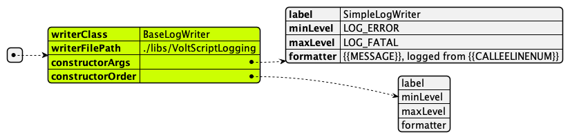

VoltScript JSON Converter provides the ability to load LogWriters from a JSON string or a JSON file. The function takes a single argument for the context from which to load the LogWriters.

- If the value passed is a valid JSON object, that will be used.
- If not, it will be treated as a filepath that contains JSON.

## Sample structure

!!! note
    Required properties are highlighted

Each LogWriter has a label, which must be unique and is used when adding it to the `globalLogSession`. In the diagram below, the LogWriter label has been set to "MyWayCoolWriter".

